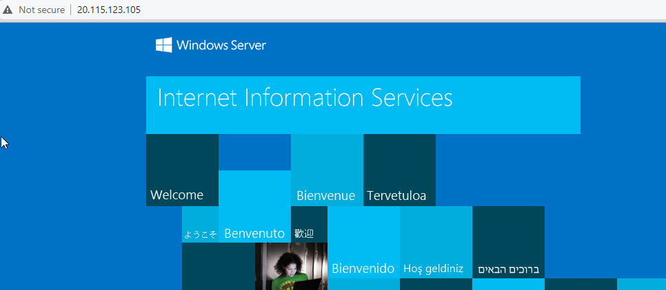
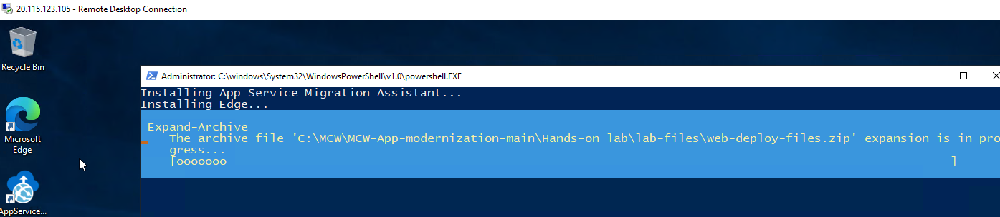
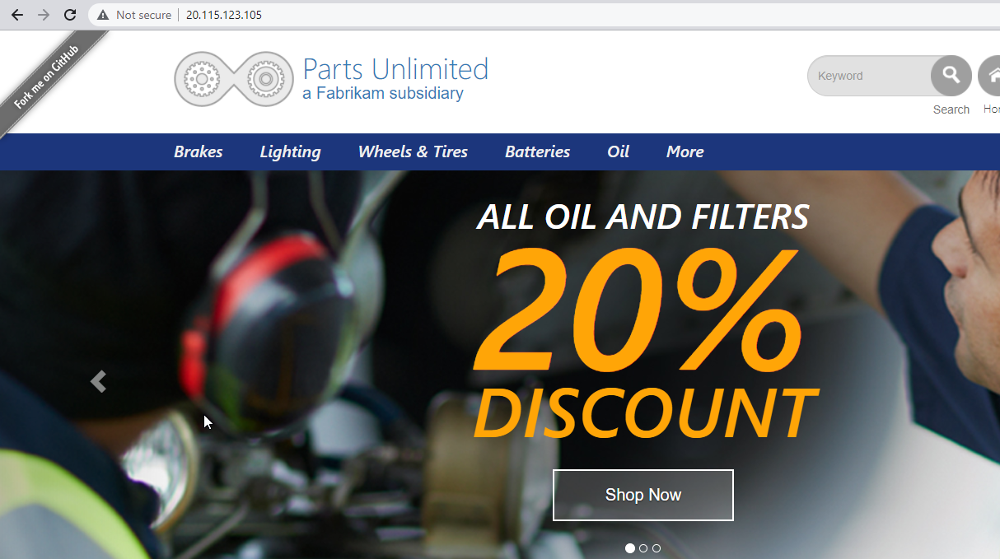
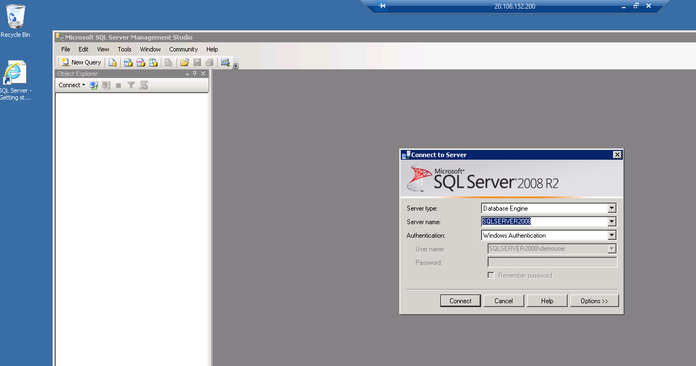
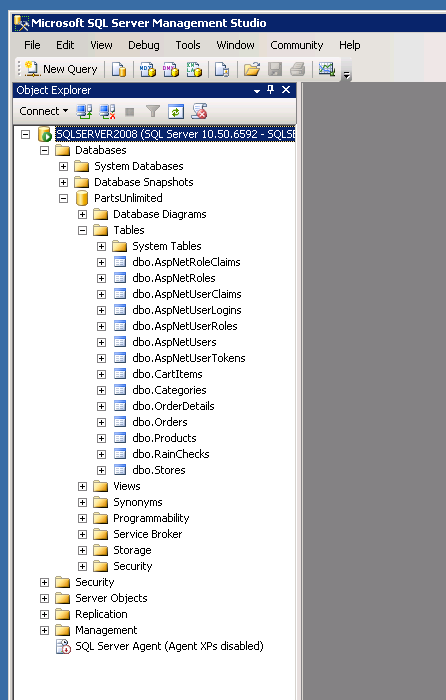

# Walkthrough

## Steps

1. Begin by running the entire "Before the HOL"

    In this step, you will deploy the VMs for SQL Server and the Web
    No matter what subscription you are on, this should work as expected/outlined

    The tool will generate:
    - Web VM with a working IIS website for Parts Unlimited as of .Net Framework 4.8
    - SQL Server VM with a working SQL Server 2008 with the Parts Unlimited site deployed to it

1. Begin the Hands-on-lab

    Run the deployment.

    Validate that you have the Web and SQL VM

    Navigate to the Web VM ip in the browser.

      

    RDP to the web vm.  The act of getting logged in will make sure that the scripts for the web deployment are completed.

      

    After the scripts are completed, once again, navigate to the Web VM ip in the browser.  This time it should work:

      

1. RDP to the SQL Server VM

    Ensure that you can log in to the SQL Server VM.

    Once in, open SSMS for SQL Server 2008 from the SQL server VM

    Use Windows Authentication to connect.

      

    Expand the SQL Server 2008 database to see the tables.

      

