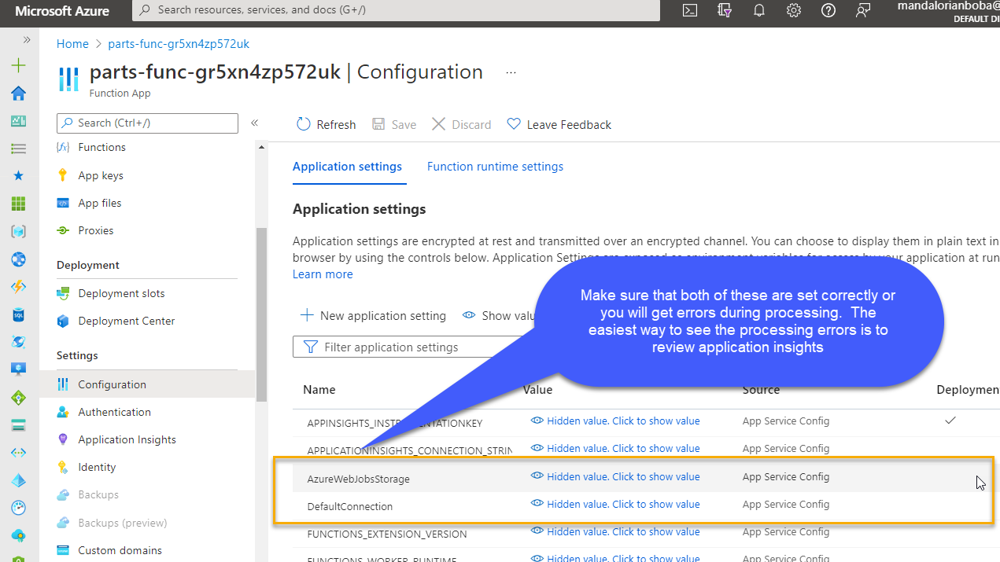

# Walkthrough

## Steps

1. Begin by running the entire `Before the HOL`

    In this step, you will deploy the VMs for SQL Server and the Web
    No matter what subscription you are on, this should work as expected/outlined

    The tool will generate:
    - Web VM with a working IIS website for Parts Unlimited as of .Net Framework 4.8
    - SQL Server VM with a working SQL Server 2008 with the Parts Unlimited site deployed to it

2. Ensure you completed the scripts for getting the deployment of the web done (the guides will ask you to do that later but it is easier to do it up front).

3. Begin the Hands-on-lab

4. The migration project is a bit tricky.  At times, you will not see your project.  You must add your tools to your project.  

5. When you migrate the web, it deploys to Azure App Service on premium, you will want to downgrade to Standard

6. With most subscriptions not Pay-as-you-go, you simply will not be able to do the server migration.  

    Instead, just create a full, copy-only backup, restore locally on your machine, create a bacpac file, upload to storage, then import to a new database at Azure.  You can likely use the Parts database that was provisioned.  Optionally, you could downgrade the parts database to basic to save money (it is currently standard).

    Another approach is to delete the parts database and create a simple basic database to save money.

7. Once you have the database restored at Azure, and you have the web solution migrated, you are done with the first part of the `app modernization`.  

8. At this point, you should have a working web application and you should have a deployed database with data in it.  You should also have added the connection string to the app service.

9. If you do not use a deployment slot, that is ok.  Instead, just use the production slot if you are on a free account.

10. You will need to use the web server until you are done so do not clean it up.  Once you have the database migrated, you should not need the sql server.  You can stop it to be safe and save some money until you are done with the activity.

11. The deployment workflow should work as expected for this application, as long as you have followed the other steps correctly.  Do not forget you cannot deploy without:

- Your secret `publish profile` being set correctly
- You must update the workflow to contain the correct web application name.  
- If you are NOT using a slot, then remove the slot portion of the deployment.

1. Make sure you make obvious changes that are visible for the deployment task so that you can easily see that your workflow is working as expected.

1. After deployment, swap to production as tasked.

1. At the end, you will have a web page that is supposed to commit orders and in the process enter a message into the queue. 

    At some point, the azure function should trigger and then respond to the storage queue.  It is polling the queue.

    Set up the app insights to view the trace.

    If you see `storage account not found` it is because you did not make sure the `AzureWebJobsStorage` environment variable on the function app was set correctly.

    If you see `SQL Server connection not created` or something similar, make sure the function app uses `DefaultConnection` from the Application Environment variables and make sure that you have that set correctly in your function app.

      
